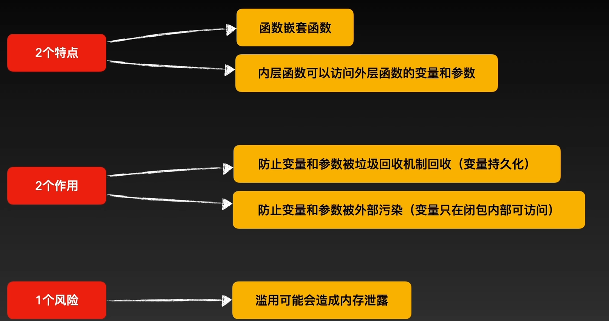
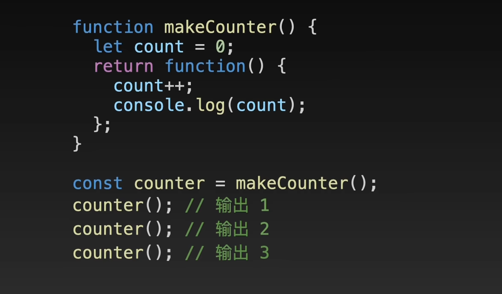

# Getting Started

This project was bootstrapped with [Create React App](https://github.com/facebook/create-react-app).

## Available Scripts

In the project directory, you can run:

### `yarn`

Installs dependencies

At first installation, you might have to run `yarn husky install`,
to setup pre-commit hooks

### `yarn start`

Runs the app in the development mode.\
Open [http://localhost:3010](http://localhost:3010) to view it in the browser.

The page will reload if you make edits.\
You will also see any lint errors in the console.

### `yarn start-home`

Start in development mode and show the home page.

### `yarn start-app`

Start in development mode and show the main app.

### `yarn test`

Launches the test runner in the interactive watch mode.\
See the section about [running tests](https://facebook.github.io/create-react-app/docs/running-tests) for more information.

### `yarn build`

Builds the app for production to the `build` folder.\
It correctly bundles React in production mode and optimizes the build for the best performance.

The build is minified and the filenames include the hashes.\
Your app is ready to be deployed!

See the section about [deployment](https://facebook.github.io/create-react-app/docs/deployment) for more information.

## Project structure

- `App/` - React App root component, contains global providers and routing configuration

- `components/` - React components

- `pages/` - Page components

- `lib/` - Infrastructure code independent of business logic (widely used in the project base modules and functions for interaction with data sources, common utils, etc.)

  - `contracts`
    - `callContract.ts` - e.g. base function for requesting contracts
  - `chains`
    - `utils.ts`
    - `constants.ts`
  - `request.js` - example base function for http requests
  - `useLockBodyScroll.ts` - common ui hook
  - `legacy.js` - Unstructured legacy code (moved from Helpers.js)

- `domain/` - Project specific domain logic separated by entities and features, may contain
  data fetching, formatting, types and constants

  - `orders/` - Example entity folder

    - `types.ts` - Entity related types
    - `utils.ts` - Functions for calculations and formatting, can be split into several files
    - `contracts.ts` - Contracts calls
    - `backend.ts` - Http requests
    - `graph.ts` - Subgraph queries
    - `useActiveOrders.ts` - some complex hook with aggregation logic
    - `constants.ts`
    - `hooks.ts`

  - `legacy.js` - Unstructured legacy code (moved from Api/index.js)

- `config/` - Often manually changed or environment-dependent global configs and constants, can contain simple getter functions
- `styles/` - Global styles
- `img/` - Images
- `abis/` - Contract abis
- `fonts/`

## Architecture guides

### React components

- Try to keep it simple and modular - only one component per file, Child components should be put separately

- Keep a **flat** components folder structure - do not nest components inside other components folders

- Keep styles and components together in the same folder

- Code, independent of state and props should be moved outside component body

- In general components should countain only ui logic, all resusable data processing code should be moved to the `domain` or `lib` folder, component-specific calculations
  can be wrapped in custom hooks or functions and placed near component

- Try to keep definition order inside component body:
  1. State - useState, useFetchedData, etc.
  2. Calculated variables from state and props
  3. Functions reused in the component, e.g. event handlers
  4. useEffect
  5. Render

<details>
    <summary>Example component structure</summary>

- `components/`
  - `SwapBox`
    - `SwapBox.js`
    - `SwapBox.css`
    - `getErrorMessage.js` - only a component-specific logic

</details>

<details>
    <summary>Example component body</summary>

```(javascript)
// components/SwapComponent/SwapComponent.tsx

import {useInfoTokens} from 'domain/tokens/contracts'
import {processSwap} from 'domain/exchange/contracts'
...

export function SwapComponent(props: Props) {
const infoTokens = useInfoTokens(props.chainId, ...);
const [selectedTokenAddress, setSelectedTokenAddress] = useState()
const [amount, setAmount] = useState()
const {tokenAmount, swapLimits, fees, ...} = useSwapState(
props, {infoTokens, selectedTokenAddress, amount}
)

...

useEffect(..., []);

async function onButtonClick() {
    ...
    await processSwap(...)
}

return (
    <div>
        ....
    </div>

}

```

Optional separating component state evaluation if it contains a lot of logic which is highly
dependent on props or a state of the component.

```(javascript)
components/SwapComponent/useSwapState.ts

import {getTokenAmount} from 'domain/tokens/apiContracts'
import {getSwapLimits} from 'domain/exchange/swap-utils'


function useSwapState(props, {selectedTokenAddress, infoTokens, amount}) {
  const infoTokens = useInfoTokens(props.chainId, ...);

  const tokenAmount = getTokenAmount(infoTokens, selectedTokenAddress, ...)
  const swapLimits = getSwapLimits(infoTokens, amount)

  const swapFee = ...
  const fees = ...

  ...some calculations

  return {...}
}
```

</details>

---

### DataFlow

Divide a code into appropriate areas of responsibility and keep the dependencies flow:

```
config -> lib (infrastructure) -> domain -> components -> pages
```

Each layer can use code from itself or from the left side. For example `lib`-modules can require `config` and other `lib`-modules, but not `domain`-modules or `components`.
Also `pages` can depend on `components`, but not vice versa.

### Typescript

- Write a new code in Typescript as far as possible
- Components should have `.tsx` exstension
- While migration, there are some issues when using
  js components inside tsx - all props are considered as required.
  To solve this, define default values for unused props or put
  jsDoc description when this is difficult

<details>
<summary>Example</summary>

```(javascript)
/**
* @param {any} props
*/
function Button(props) {...}
```

</details>

---

### Translation

- The language code should be a valid [BCP-47](https://unicode-org.github.io/cldr-staging/charts/latest/supplemental/language_plural_rules.html) code like `es` for `Spanish`.
- The formatting used in `.po` files for each language is know as ICU MessageFormat. To understand it please refer to this [GUIDE](https://lingui.js.org/ref/message-format.html)

### SCSS

Use the following syntax to import scss modules:

```
@use "src/styles/colors";

.ClassName {
  background: colors.$color-red;
}
```

---
kadex  


## 函数柯里化（颗粒化）


## 闭包


## 界面

